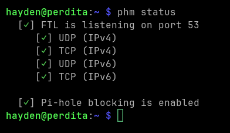
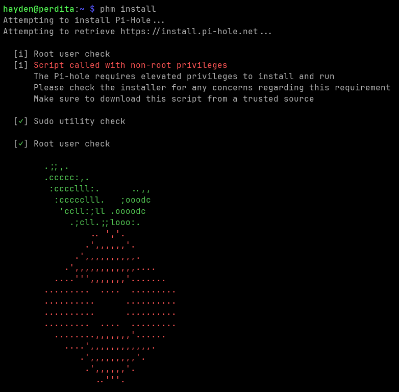

# User Guide

## Install

### Install phm

`phm` is a stand-alone python script. It only uses the standard
library and should run on any system with `python3`. However,
installing pihole will only work out of the box on their supported
systems.

#### Download `phm`

``` shell
curl -sSL https://raw.githubusercontent.com/hholb/phm/main/phm > phm
```

#### Optional: Add execute permission

``` shell
chmod +x phm
```

#### Run phm
With execute permission.

``` shell
./phm status
```

Without execute permission.

``` shell
python3 phm status
```
If pihole is installed and running you should see the status.



#### Optional: Add `phm` to `$PATH`
Adding `phm` to your `$PATH` environment variable makes it so you can
run `phm` without `./` or `python3`.

``` shell
mkdir ~/bin
mv phm ~/bin/phm
export PATH="~/bin:$PATH"
# no longer need ./phm or 'python3 phm'
phm status
```

### Install pihole

``` shell
phm install
```

This starts the installer which walks you through the installation process.



#### Post-install

After install pihole, you need to tell other devices on your network
to use pihole as their default DNS server. This is device specific, so
you will need to look up how to confiugre DNS settings for your
device. Typically you need to set the IP address of the DNS server you
want to use somewhere in the network/internet configureation settings.

A better option is to configure your router to automatically tell
devices to use the pihole as their primary DNS server. This is also
specific to your router, so look up the details for your specific
hardware. Usually you need to login to your routers admin interface
and configure default DNS settings to use the pihole's IP address.

Refer to the [pihole post-install](https://docs.pi-hole.net/main/post-install/) documentation for additional details.

## Uninstall

### Uninstall pihole

Remove pihole from your system using `phm uninstall`.

``` shell
phm uninstall
```


### Uninstall phm

To uninstall `phm` simply delete the `phm` script.

``` shell
rm phm
```

## Usage
### `add-adlist`
Insert records into the pihole database from the given ad list. The
ad list should be a text file where each line is the URL of a list of
domains. See [this](https://firebog.net/) for examples. Many of these
lists are included with phm.

``` shell
phm add-adlist --adlist adlist.txt
```

You can pass the `--no-update` flag to insert the ad domains wihtout
running the pihole databse update script. This means the domains will
not be on the blacklist until the pihole restarts or you run `phm update`

### `help`
Print the help text for `phm`

``` shell
phm --help
# or
phm -h
```

### `install`
Installs pihole. If pihole is already installed, this will let you
reconfigure the current install.

``` shell
phm install
```

### `status`
View pihole status. This is just a wrapper around `pihole status`

``` shell
phm status
```

### `update`
Update the pihole software, and trigger and update of the pihole
database.

``` shell
phm update
```

### `uninstall`
Remove pihole from the system.

``` shell
phm uninstall
```

To uninstall `phm` simply remove the `phm` script.

``` shell
rm phm
```
